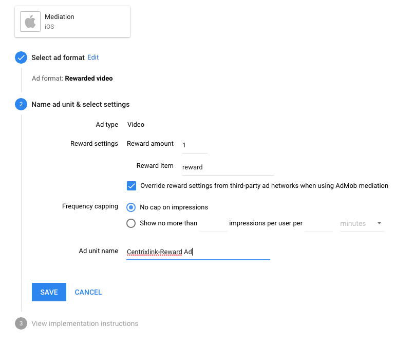
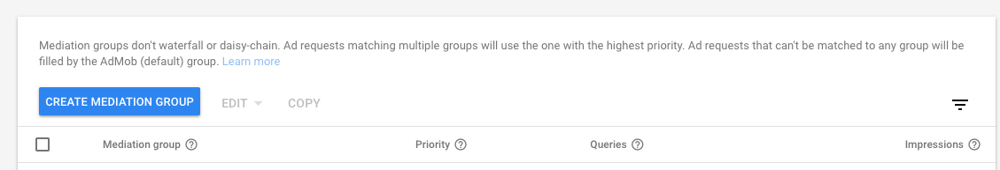
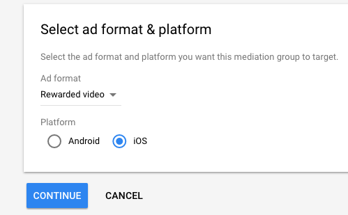
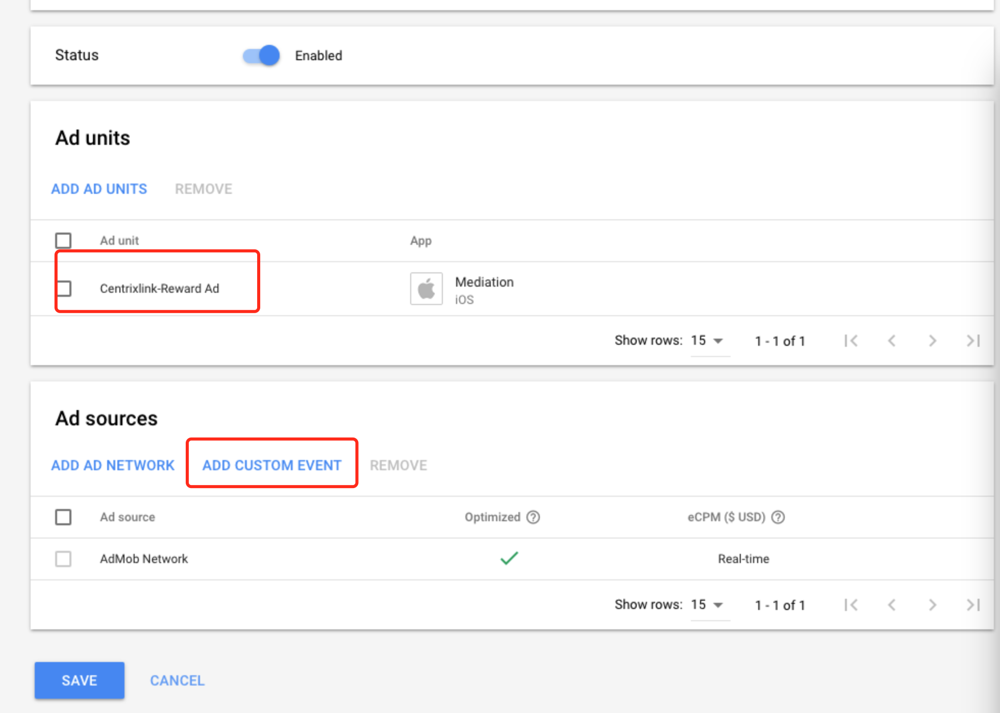
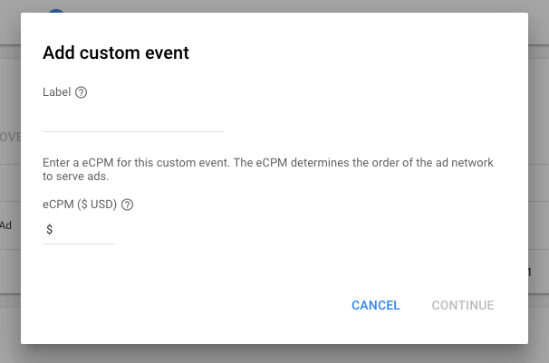
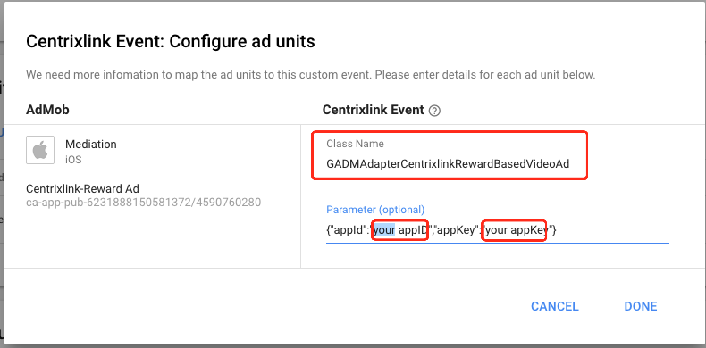
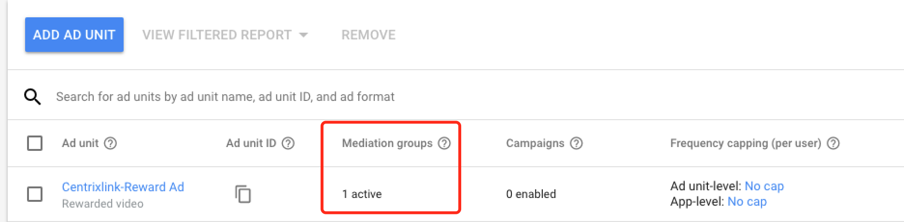

# AdMob-iOS-Adapter

**目录:**


### 步骤1: 前往AdMob，将Centrixlink添加到Mediation group


##### 1. 登录AdMob，并前往Apps选项卡，创建应用和广告单元


##### 2. 前往Mediation选项卡，点击CREATE MEDIATION GROUP



##### 3. 选择广告格式和应用平台

 

##### 4. 添加Ad sources


##### 5. ADD CUSTOM EVENT


##### 6. 填写参数如下（注意Class Name不能修改，并且将appID和appkey替换成你在Centrixlink平台申请的appID和appkey）


##### 7. 点击Done后，如果成功你会发现你的广告单元下会出现如图所示



### 步骤2: 集成Centrixlink Adapter和SDK

##### 1. 下载[Centrixlink Adapter](https://github.com/centrixlink/AdMob-iOS-Adapter)，然后添加到你的项目。

##### 2. 集成Centrixlink iOS SDK到你的项目中，请遵循“[Centrixlink -iOS SDK 文档](https://github.com/centrixlink/Centrixlink-iOS-SDK)”的说明。


### 步骤3: 播放激励视频广告

```objc
GADRequest *request = [GADRequest request];
GADMCentrixlinkExtras *centrixlinkExtras =[[GADMCentrixlinkExtras alloc] init];
centrixlinkExtras.userId = @"custom_userId";
[request registerAdNetworkExtras:centrixlinkExtras];
[[GADRewardBasedVideoAd sharedInstance] loadRequest:request
withAdUnitID:@"Your Ad unit ID"];
```

### 传递补充参数（可选）

| 属性 | 说明 |
| --- | --- |
| userId | 设置唯一的用户ID，这个用户ID将被传递到Centrixlink SDK，用于奖励广告的S2S回调。 |
| options | 自定义上传跟此次广告播放相关数据，便于跟踪广告及广告激励(扩展key可参考CentrixlinkConst.h) |


